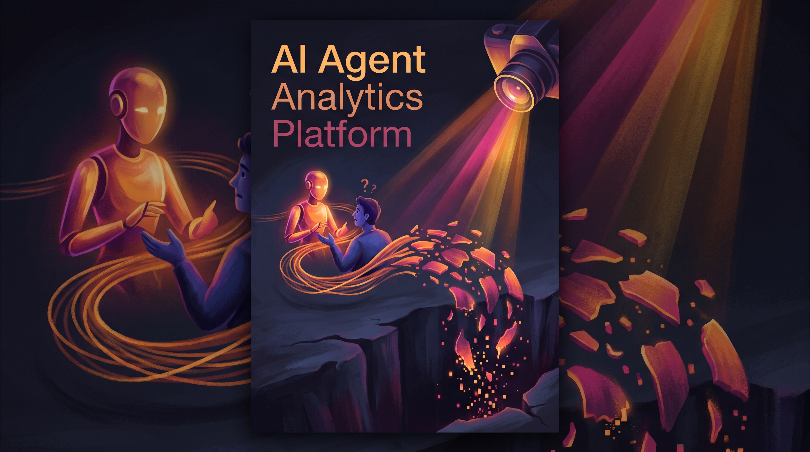

<p align="center">
  
</p>

<h3 align="center">Product analytics specifically designed for conversational AI and AI agents, showing where users struggle and drop off in AI interactions.</h3>

<p align="center">
  <a href="#quick-start">Quick Start</a> &bull;
  <a href="#features">Features</a> &bull;
  <a href="#examples">Examples</a> &bull;
  <a href="#contributing">Contributing</a>
</p>

### What is this?
The AI Agent Analytics Platform captures and analyzes conversation data from AI agents to reveal where users get confused, abandon chats, or express frustration. It is built for product teams that need visibility into multi-turn interactions that traditional click‑based tools miss.  
Example: start the backend API and see it ready to accept webhook payloads.

```
$ uvicorn backend.main:app --host 0.0.0.0 --port 8000
INFO:     Started server process [12345]
INFO:     Waiting for application startup.
INFO:     Application startup complete.
INFO:     Uvicorn running on http://0.0.0.0:8000 (Press CTRL+C to quit)
```

### Problem
Traditional product analytics tools like Amplitude are designed for button‑based UIs, but they don't work for conversational AI products and AI agents. Teams building AI products have no visibility into where users get confused, stuck, or frustrated during conversations. This blind spot makes it impossible to systematically improve AI agent performance and user experience.

### Features
| Feature | Description |
|---------|-------------|
| Conversation Flow Tracking | Records each turn of a dialogue, maps drop‑off points, and visualizes complete conversation trees. |
| Intent Recognition Analytics | Measures intent classification accuracy, detects rephrasing patterns, and generates confusion matrices. |
| User Frustration Detection | Uses NLP to spot frustration signals (repetition, negative sentiment, escalation requests) and trends over time. |
| Conversation Success Metrics | Calculates completion rates, average turn length, and satisfaction scores per segment. |
| SDK & Webhook Integration | Provides a Python SDK and HTTP webhook endpoints for easy ingestion from any AI agent. |
| Real‑time Dashboard | React‑based UI with Chart.js visualizations for flow diagrams, intent accuracy, and frustration alerts. |
| Configurable Alerting | Sends notifications when frustration or drop‑off rates exceed user‑defined thresholds. |
| Data Retention Controls | Automatically purges conversation data after a configurable number of days to manage storage. |

### Quick Start
1. Clone the repository:  
   `$ git clone https://github.com/yourorg/ai-agent-analytics-platform.git`
2. Backend setup:  
   `$ cd ai-agent-analytics-platform/backend`  
   `$ pip install -r requirements.txt`  
   `$ cp .env.example .env`  # edit API_SECRET_KEY and other vars as needed  
   `$ uvicorn main:app --reload`
3. Frontend setup:  
   `$ cd ../frontend`  
   `$ npm install`  
   `$ npm run dev`  
4. Open http://localhost:3000 in your browser to view the dashboard.

### Examples
**Start the API and verify health**  
```
$ curl http://localhost:8000/health
{"status":"ok","timestamp":"2025-09-16T12:34:56Z"}
```

**Send a conversation webhook**  
```
$ curl -X POST http://localhost:8000/webhook \\
  -H "Content-Type: application/json" \\
  -H "X-Signature: $(python -c \"import hmac,hashlib,os; print(hmac.new(os.getenv('API_SECRET_KEY').encode(),b'{\"user_id\":\"u1\",\"turns\":[{\"role\":\"user\",\"text\":\"Hi\"},{\"role\":\"agent\",\"text\":\"Hello\"}]}'.encode(),hashlib.sha256).hexdigest())\") \\
  -d '{"user_id":"u1","turns":[{"role":"user","text":"Hi"},{"role":"agent","text":"Hello"}]}'
{"event_id":"a1b2c3","stored":true}
```

**Query drop‑off analytics for the last 7 days**  
```
$ curl http://localhost:8000/analytics/drop-off?days=7
{"total_conversations":1245,"completed":782,"drop_off_rate":0.372,"drop_off_by_turn":{"1":0.12,"2":0.08,"3":0.05,"4+:0.122}}
```

### File Structure
```
AI Agent Analytics Platform/
  backend/                  # FastAPI server and core logic
    main.py                 # API entry point
    routes.py               # Webhook and analytics endpoints
    models.py               # SQLAlchemy models
    database.py             # Session and engine setup
    requirements.txt        # Python dependencies
  frontend/                 # React dashboard
    src/
      components/           # Reusable UI cards, badges, modals
      pages/                # Dashboard and detail views
      lib/                  # API service layer
      App.tsx               # Root component
      main.tsx              # Vite entry point
    public/                 # Static assets
    vite.config.ts          # Vite configuration
    package.json            # npm scripts and deps
  assets/                   # Graphics and docs
    infographic.png         # Banner illustration
  .gitignore                # Ignored files
  init.sh                   # One‑line setup helper (optional)
  README.md                 # This file
```

### Tech Stack
| Technology | Purpose |
|------------|---------|
| React 19   | Frontend UI library |
| Vite       | Fast frontend build tool |
| Tailwind CSS | Utility‑first styling |
| FastAPI    | Async Python backend and API |
| SQLite     | Lightweight relational store |
| spaCy      | Natural language processing |
| pandas + NumPy | Data manipulation and metrics |
| Chart.js   | Interactive charts and diagrams |
| pytest     | Backend test runner |
| Vitest     | Frontend test runner |
| Python SDK | Client library for AI agents |

### Contributing
Fork the repo, make your changes, run tests (`pytest` and `npm test`), then submit a pull request. Please keep commits focused and update the README if needed.

### License
MIT

### Author
Matthew Snow -- [M2AI](https://m2ai.co) | [@m2ai-portfolio](https://github.com/m2ai-portfolio)